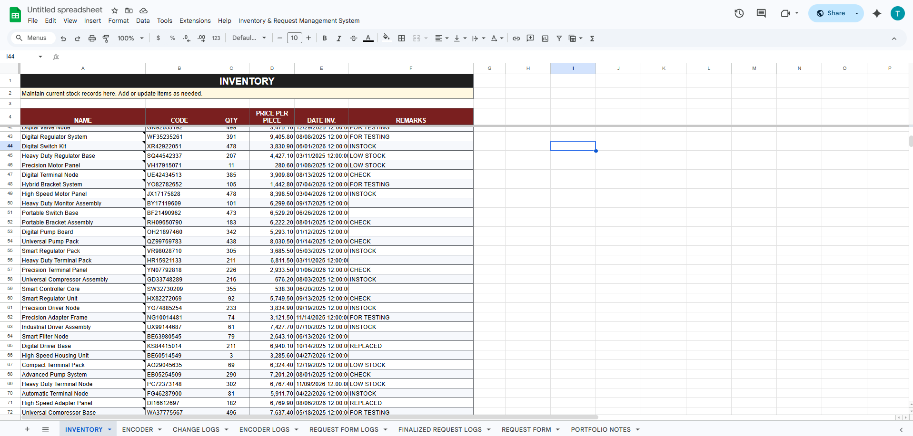
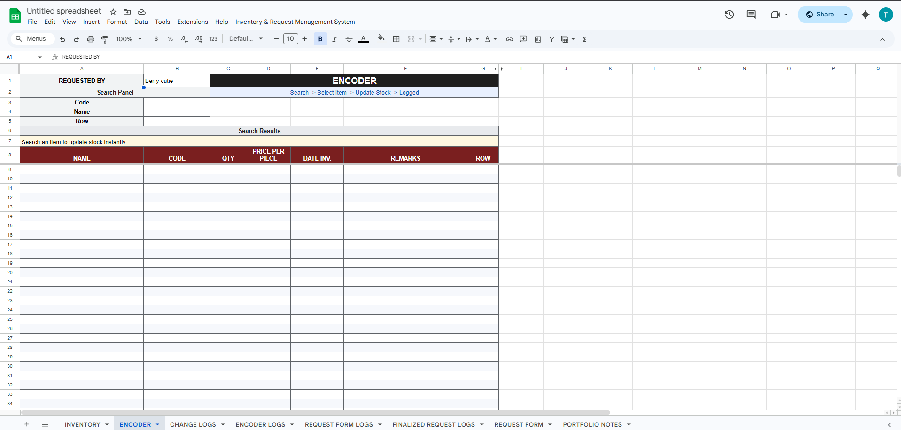
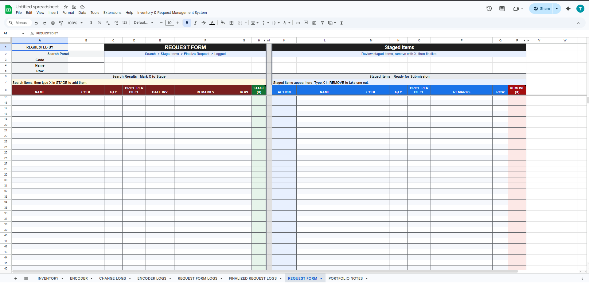
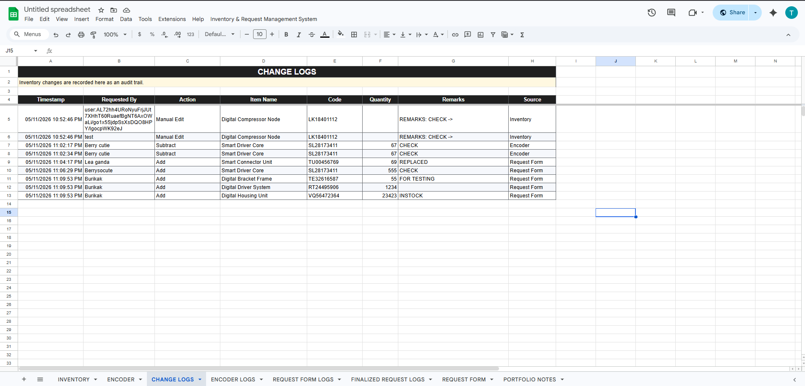
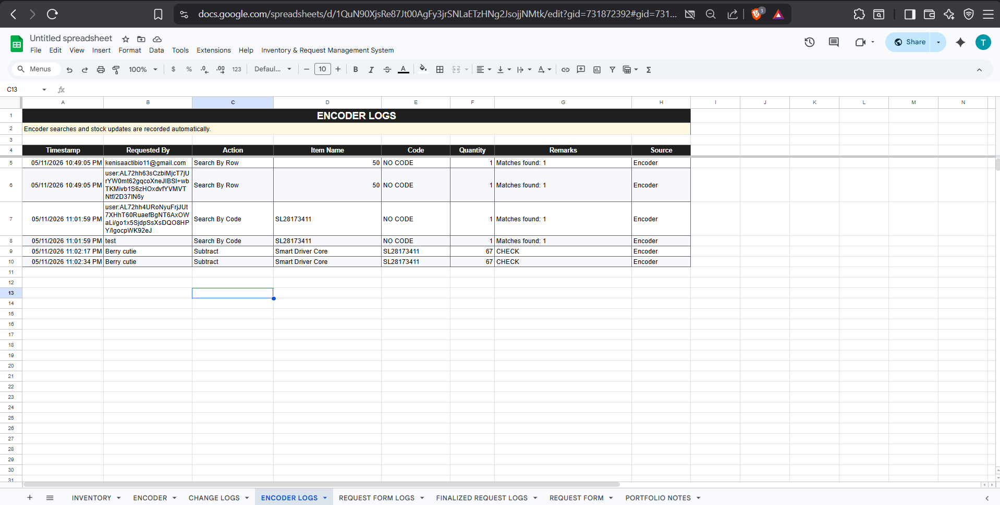
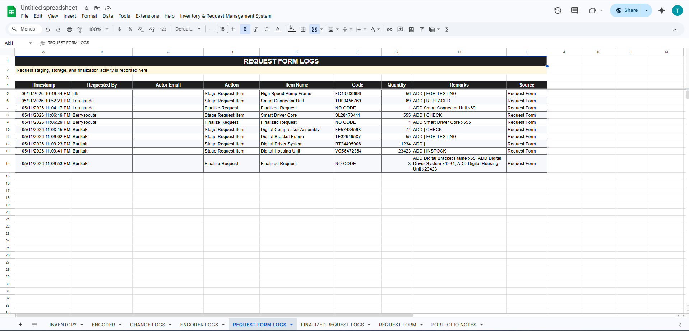
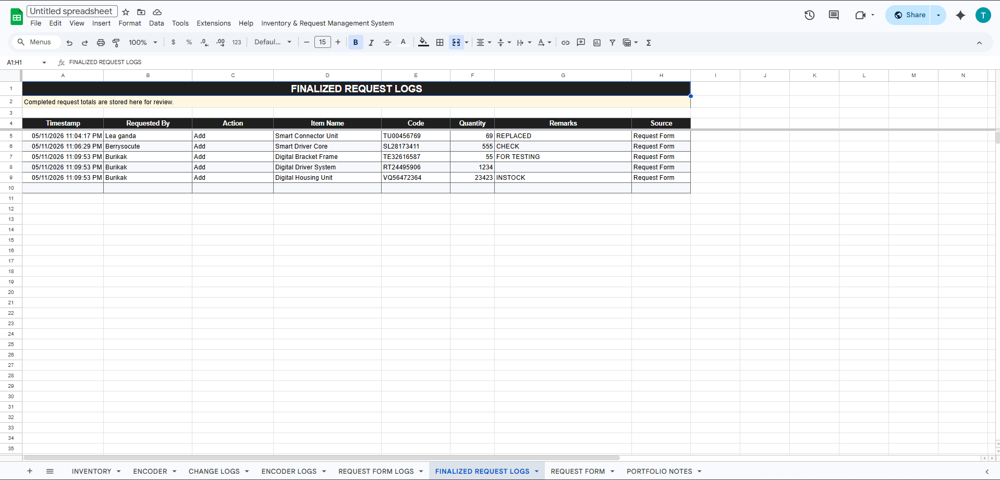

# Inventory & Request Management System

This is a Google Sheets inventory and request tracker with Apps Script automation. It is meant for a small team that needs to keep stock records, search items quickly, stage requests, keep logs, and share a separate view-only copy without giving everyone access to the working spreadsheet.

The main file is still a spreadsheet. The scripts add menus, setup actions, search handling, logging, request handling, and view-only syncing.



## What This System Does

- Keeps the main inventory list in the `INVENTORY` sheet.
- Provides an `ENCODER` sheet for quick searching and stock actions.
- Provides a `REQUEST FORM` sheet for staging and finalizing item requests.
- Writes activity to log sheets.
- Creates one linked view-only spreadsheet for people who only need to view inventory.
- Prevents duplicate view-only spreadsheets after the first one is created.
- Limits first-time view-only creation to the spreadsheet owner by default.
- Adds a custom menu to run setup, verification, sync, and request actions.

## Main Sheets

| Sheet | Used For |
| --- | --- |
| `INVENTORY` | Source list of items, quantities, prices, dates, and remarks. |
| `ENCODER` | Search by code, name, or row and start stock actions. |
| `REQUEST FORM` | Stage requested items, store unfinished requests, and finalize requests. |
| `CHANGE LOGS` | Records inventory-related changes. |
| `ENCODER LOGS` | Records encoder searches and actions. |
| `REQUEST FORM LOGS` | Records request form actions. |
| `FINALIZED REQUEST LOGS` | Records finalized request rows. |
| `PORTFOLIO NOTES` | Short notes about the spreadsheet system. |
| `__REQUEST_TEMP_STORE` | Internal storage for temporary requests. Users should not edit it. |





## Custom Menu

After the spreadsheet loads, this menu appears:

```text
Inventory & Request Management System
```

Menu items currently wired in `code.gs`:

| Menu Item | What It Runs | Notes |
| --- | --- | --- |
| `Initialize System` | `APP_initializeSystem` | Creates or repairs the sheets, formatting, logs, and triggers. |
| `Run Verification` | `runHealthCheck` | Checks the setup and reports problems. |
| `Open/Create View-Only Spreadsheet` | `SYNC_createViewOnlySpreadsheet` | Creates the linked view-only spreadsheet once, then opens it later. |
| `Sync View-Only Now` | `manualSyncToTarget` | Copies current source data into the linked view-only spreadsheet. |
| `Finalize Staged Request` | `REQ_finalizeRequest` | Applies the staged request and writes logs. |
| `Store Request Temporarily` | `REQ_storeTemporarily` | Saves the current staged request. |
| `Pull Temporary Request` | `REQ_pullStoredRequest` | Loads a saved temporary request. |
| `Delete Temporary Request` | `REQ_deleteStoredRequest` | Deletes a saved temporary request. |
| `Clear Staged Request` | `REQ_clearItemsTaken` | Clears the staged request area. |

## Requirements

- A Google account.
- Access to Google Sheets and Google Drive.
- Permission to open Apps Script on the spreadsheet.
- A desktop browser for setup and maintenance.
- Popups allowed for Google Sheets if you want the view-only spreadsheet to open automatically in a new tab.

The scripts use the Apps Script V8 runtime and these services:

- `SpreadsheetApp`
- `DriveApp`
- `PropertiesService`
- `LockService`
- `ScriptApp`
- `Session`
- `HtmlService`
- `Utilities`

The required scopes are listed in `appsscript.json`.

## Project Files

| File | Purpose |
| --- | --- |
| `Config.gs` | Main settings for sheets, menus, layouts, logging, and view-only behavior. |
| `AppConfig.gs` | Shared helpers, inventory lookup, locking, dialogs, triggers, and health checks. |
| `code.gs` | Spreadsheet menu and encoder behavior. |
| `RequestFormModule.gs` | Request form, staging, temporary requests, and finalization. |
| `AuditLoggingModule.gs` | Log sheet creation, formatting, and log writing. |
| `SetupVerificationModule.gs` | Setup, repair, trigger installation, and verification. |
| `ViewOnly.gs` | View-only spreadsheet creation, owner checks, syncing, and protection. |
| `appsscript.json` | Apps Script manifest and OAuth scopes. |

## Documentation

The rest of the documentation is in the `docs` folder:

| File | Use It For |
| --- | --- |
| [`docs/USER_MANUAL.md`](docs/USER_MANUAL.md) | Daily use instructions for staff. |
| [`docs/COMPLETE_SETUP_GUIDE.md`](docs/COMPLETE_SETUP_GUIDE.md) | First-time spreadsheet and Apps Script setup. |
| [`docs/ADVANCED_TECHNICAL_DOCUMENTATION.md`](docs/ADVANCED_TECHNICAL_DOCUMENTATION.md) | Maintainer notes for the actual code and config. |

## First Setup

1. Create or open the Google Sheet that will become the main inventory file.
2. Open `Extensions > Apps Script`.
3. Add each `.gs` file and paste the matching code.
4. Enable and update `appsscript.json` in Apps Script project settings.
5. Save the Apps Script project.
6. Refresh the spreadsheet.
7. Open the custom menu.
8. Run `Initialize System`.
9. Approve Google authorization prompts using the owner account.
10. Run `Run Verification` after setup finishes.

If the menu does not appear after saving, refresh the spreadsheet again. Apps Script menus are created when the file opens.

## Configuration Notes

Most settings live in `Config.gs`. For normal use, the defaults should stay in place.

Settings that are usually safe to edit:

- `APP_CONFIG.appName`
- `APP_CONFIG.system.menu` labels
- help text under `APP_CONFIG.templates`
- colors and column widths
- `APP_CONFIG.viewOnly.ownerTemporaryUserKeyOverride` if Google hides the owner's email

Settings that should be changed only in a test copy:

- sheet names under `APP_CONFIG.sheets`
- row and column positions under `APP_CONFIG.structures`
- inventory column numbers under `APP_CONFIG.inventory.cols`
- request table column numbers under `APP_CONFIG.request`
- trigger handler names under `APP_CONFIG.triggerHandlers`
- document property keys under `APP_CONFIG.properties`

## View-Only Spreadsheet

The view-only spreadsheet is a separate Google Sheet created by the script. It is useful when people need to see inventory but should not edit the main workbook.

Current behavior:

- The owner creates it from `Open/Create View-Only Spreadsheet`.
- The linked spreadsheet ID is saved in document properties.
- Later clicks open the existing linked spreadsheet.
- A document lock prevents two users from creating it at the same time.
- The generated sheet is protected.
- The dialog keeps a fallback link visible in case the browser blocks the new tab.

Important config values:

```javascript
createOnceOnly: true,
ownerOnlyCreate: true,
ownerEmailOverride: '',
ownerTemporaryUserKeyOverride: '',
autoOpenAfterCreate: true,
autoOpenExisting: true,
allowRecreateIfMissing: false
```

If owner-only creation fails and the error shows `currentUserEmails: []`, Google is hiding the current user's email from Apps Script. In that case, copy the reported temporary user key into `ownerTemporaryUserKeyOverride` and try again.

## Logs

The system writes to these log sheets:









Do not edit log sheets during normal use. They are there to help check what happened later.

## Normal Use

For inventory staff:

- Add or update item rows in `INVENTORY` if you are allowed to edit the source list.
- Use `ENCODER` when searching or updating stock through the scripted flow.
- Use `REQUEST FORM` when several items need to be staged before finalizing.
- Run `Sync View-Only Now` after large manual edits if viewers need the latest copy right away.

For viewers:

- Use the view-only spreadsheet link.
- Do not use the main workbook unless the owner gives you access.

For the owner:

- Run setup and authorization.
- Create the view-only spreadsheet once.
- Manage sharing on both the main workbook and the view-only workbook.
- Keep backups before code or layout changes.

## Common Problems

| Problem | Usual Cause | Fix |
| --- | --- | --- |
| Custom menu is missing | Spreadsheet opened before scripts finished saving | Refresh the spreadsheet. |
| Authorization prompt appears | First run or changed scopes | Approve only if you trust the code and are using the right account. |
| Owner-only error appears for the real owner | Apps Script hid the current email | Use the diagnostic details and set `ownerTemporaryUserKeyOverride`. |
| View-only file does not open in a new tab | Browser blocked the popup | Use the fallback link in the dialog. |
| Sync fails | Linked target is missing or inaccessible | Check the stored target status and Drive sharing. |
| Logs are not updating | Trigger missing or failing | Run `Initialize System`, then check Apps Script executions if needed. |
| Search results look wrong | Sheet layout or columns were changed | Run verification and compare `Config.gs` with the actual sheet layout. |

## Maintenance

Keep maintenance simple:

- Make a spreadsheet copy before changing scripts.
- Test layout or config changes in a copy first.
- Do not delete the generated view-only spreadsheet unless you also plan to reset the stored link.
- Keep edit access limited to people who actually update inventory or requests.
- Review Apps Script executions when users report script errors.

## Quick FAQ

### Is the view-only spreadsheet the source of truth?

No. The main spreadsheet is the source. The view-only spreadsheet is copied from it.

### Can editors create the view-only spreadsheet?

Not by default. `ownerOnlyCreate` is set to `true`.

### Why is there an owner temporary user key setting?

Some Gmail accounts do not expose the current user's email to Apps Script. The temporary key lets the script recognize the owner without turning off owner-only protection.

### Can I rename sheets?

Yes, but only if you also update the matching values in `Config.gs`. Test this in a copy first.

### Can I add columns?

You can, but any scripted workflow that reads fixed columns may need config or code changes. Do not add workflow-critical columns directly in production without testing.

### What should I do before changing code?

Make a backup copy of the spreadsheet, change a test copy first, and run `Run Verification` after the update.
